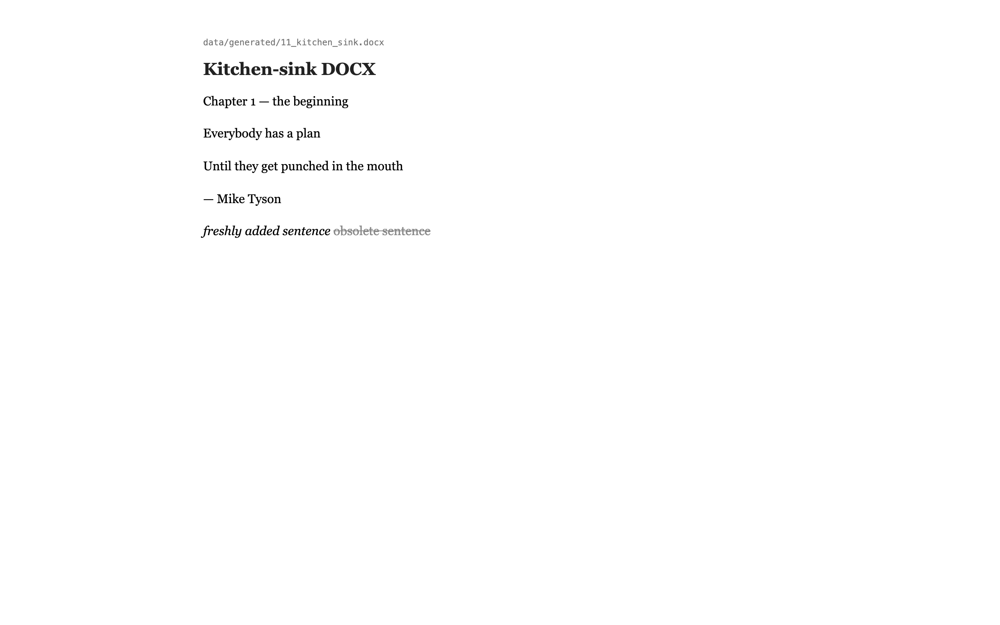
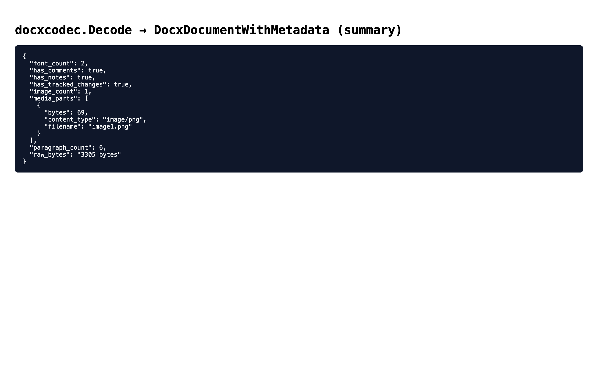
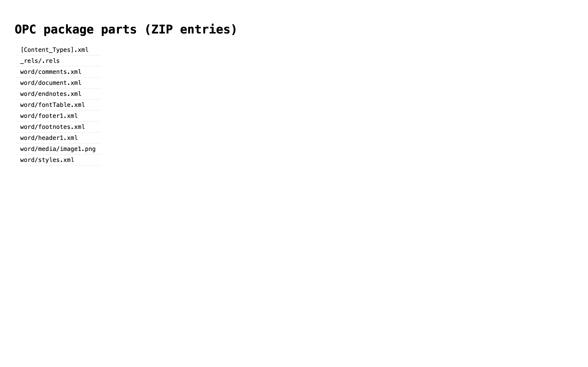

# proto-docx

DOCX (OOXML WordprocessingML) codec for the OpenFormat proto family.
Sibling of [`proto-xml`](https://github.com/accretional/proto-xml); it
depends on that repo for the shared `MimeType` type and for `xmlcodec`
(when a caller wants to introspect individual OOXML parts as typed
XML).

```go
import "openformat-docx/docxcodec"

doc, err := docxcodec.Decode(raw)   // raw is a .docx (ZIP of XML parts)
// ... inspect doc.DocxPackage, doc.ParagraphCount, doc.HasTrackedChanges ...
out, _ := docxcodec.Encode(doc)     // byte-identical round-trip via RawBytes

text, _ := docxcodec.ExtractText(raw)   // paragraph text, one per line
fonts, _ := docxcodec.ExtractFonts(raw) // font family names from fontTable.xml

// Or for richer access (typed XML tree + extraction methods in one object):
d, _ := docxcodec.DecodeWith(raw, docxcodec.DecodeOptions{IncludeTypedParts: true})
_ = d.Document    // *XmlDocumentWithMetadata for word/document.xml
_ = d.Text()      // same as ExtractText
_ = d.Fonts()     // same as ExtractFonts
_ = d.Images()    // doc.DocxPackage.MediaParts, as a convenience
```

See [`docs/about.md`](docs/about.md) for a worked walk-through.

## Screenshots

Generated by `cmd/demo-screenshots` against the
`data/generated/11_kitchen_sink.docx` fixture, captured via a
[`chromerpc`](https://github.com/accretional/chromerpc) server at
`localhost:50051`.



*Figure 1.* The kitchen-sink fixture's extracted paragraphs rendered as
HTML — including a tracked insertion (italic) and deletion
(strikethrough).



*Figure 2.* The same fixture after `docxcodec.Decode`, summarised as
JSON. Paragraph / image / font counts and tracked-changes detection
are populated directly on `DocxDocumentWithMetadata`; the original
bytes survive in `raw_bytes` so `Encode` is lossless.



*Figure 3.* The ZIP-level view — the OPC package entries (`[Content_Types].xml`,
`word/document.xml`, media parts, footnotes, comments, headers/footers,
etc.) that make up the fixture.

Regenerate with:

```sh
CHROMERPC_ADDR=localhost:50051 go run ./cmd/demo-screenshots -force
```

## Instructions

Make sure you create a setup.sh, build.sh, test.sh, and LET_IT_RIP.sh that contain all project setup scripts/commands used - NEVER build/test/run the code in this repo outside of these scripts, NEVER commit or push without running these either. Make them idempotent so that each build.sh can run setup.sh and skip things already set up, each test.sh can run build.sh, each LET_IT_RIP runs test.sh

use go1.26, use https://github.com/accretional/proto-xml as a dependency and document that.

First Import https://github.com/accretional/mime-proto/blob/main/pb/proto/openformat/v1/docx.proto to docx.proto and related docx-specific logic

1. CAREFULLY review docx.proto for issues/oddness and especially other media/encoding formats. Document everything troubling you find, and any related media formats we may want to implement in other .proto and link-in, in review.md
2. Make sure the encoder/decoder use cases work fully e2e with unit tests.
3. Create data/ directory with multiple docx files exhibiting various different aspects of the format that we can use for testing. Create some programmatically using the protos and others just as regular old docx files.
4. Create a testing/validation/ directory running a suite of tests (for now just one) across all the data/
5. Create a testing/fuzz/ directory running fuzzing tests
6. Create a testing/benchmarks directory running benchmarks across the data
7. Document any discrepancies or irregularities in the testing in testing/README.md, as well as the overall strategy/setup
8. Augment this README.md in ## NEXT STEPS with anything important you find, any irregularities in the file format, bad implementations, missing functionality, etc.
9. Write a docs/about.md explaining this project, with examples, in a way someone might actually use it (eg with rss). Use github.com/accretional/chromerpc to take screenshots as you walk through a demo of a real docx file. Prepare to embed these images in about.md in the github markdown format.

## NEXT STEPS

Findings surfaced while bootstrapping the codec, fixtures, and test
suite. Full annotated review of every issue lives in `review.md`; the
list below is the short version for navigators.

### Upstream proto (`accretional/mime-proto`, `openformat/v1/docx.proto`)

- **`conform_ance_strict` (line 150) has a stray underscore.** Should be
  `conformance_strict`. Worth renaming before the schema has wire-level
  consumers (`review.md` #1).
- **`DrawingVerticalPosition.v_align` references the wrong enum.** It
  points at `VerticalAlignment` (text-run baseline/superscript) when
  it should point at `DrawingVerticalAlignment`. Three different
  `*VerticalAlign*` enums in the same file model three different axes —
  easy to miswire (`review.md` #2, #3).
- **`Style.rsid` is `int32`** but RSIDs are 8-hex-char tokens —
  `RevisionSaveIds.rsid_r` elsewhere in the same schema correctly uses
  `string`. Silently truncates for typical inputs. Should be `string`
  (and wrapped, since zero is a valid RSID) (`review.md` #5, #12).
- **Unused `import "openformat/v1/mime.proto"` (line 35).** No
  `MimeType` appears in the file body, so `protoc-gen-go` warns on every
  build. Either drop the import or use `MimeType` on
  `MediaPart.content_type` and `CustomXmlPart.content_type` in place of
  the bare `string` (`review.md` #20).
- **`AbstractNum.multi_level_type`, `ShapeOutline.val`,
  `FormFieldData.entry_macro`/`exit_macro` are all `string` with
  docstring-enumerated values.** Enum types would catch typos and let
  consumers exhaust-switch (`review.md` #6, #8, #10).
- **`Comment.id` is `int32` with proto3 zero-value semantics** —
  `id == 0` is indistinguishable from unset, even though the spec doesn't
  forbid ID 0 (`review.md` #11).
- **File header scopes the schema's ambitions but doesn't list what is
  intentionally *not* modeled** (DrawingML internals, VML, OLE, macros,
  signatures). Adding a "Not modeled" section would save reviewers time
  (`review.md` #25).

### Format-level gaps exposed by the vendored schema

Everything below arrives as `bytes` and round-trips via `RawBytes`, but
is not introspectable via typed fields:

- **DrawingML** — charts, SmartArt diagrams, shapes, and pictures. The
  `GraphicObject.data` oneof is declared but its messages are stubs or
  back onto raw XML. Would deserve its own `proto-drawingml`.
- **VML** — `Picture.vml_data` is raw XML bytes. Legacy but still common
  in real-world headers/footers.
- **OLE** — `Object.ole_data` is bytes. Embedded spreadsheets, Equation
  Editor 3.0 content, and anything else wrapped in a Compound File
  Binary container stays opaque. Related formats worth their own
  protos: CFBF, embedded `.xlsx` fragments, Equation Editor 3.0.
- **OMML** — Office Math Markup isn't modeled at the top level; it only
  appears indirectly via `w:oMath` inside text runs.
- **Theme bits** — `Theme.object_defaults` and `extra_clr_scheme_lst`
  are bytes. Round-trip-safe, not inspectable.
- **Macros (`.docm`, `word/vbaProject.bin`)** — schema models macro
  *references* (`FormFieldData.entry_macro` etc.) but not macro storage.
- **XMLDSig / XAdES signatures** — `_xmlsignatures/` and signed
  `_rels` parts aren't modeled; signed-document fidelity today comes
  only from the raw-bytes path.
- **OPC / OCF generic container** — the ZIP-of-XML scaffolding is
  rebuilt locally here and (identically) in DOCX, XLSX, PPTX, EPUB
  consumers. Highest-leverage thing to factor out into a shared
  `proto-opc` (`review.md` §5).

### Codec implementation gaps (this repo)

- **Structural encode is not implemented.** `Encode` returns
  `RawBytes` verbatim. Mutating a decoded proto and expecting
  byte-different output silently returns the original bytes. A real
  encoder needs the full OOXML schema covered, which is deliberately
  out of scope for this cut.
- **Extraction APIs are partially ported.** `ExtractText`,
  `ExtractFonts`, and the `Decoded.Text()` / `.Fonts()` / `.Images()`
  methods now cover the high-traffic surface. `ExtractSections`
  (section-property walks over `<w:sectPr>`) is still unported —
  worthwhile for paginated/multi-section documents. The mime-proto
  versions return typed proto messages; ours return plain Go values
  (`string`, `[]string`, `[]*MediaPart`) because the richer return
  types depend on `openformat.proto` / `pdf_document.proto` which
  aren't vendored here.
- **Typed XML parts beyond `word/document.xml` still require manual
  unzipping.** `docxcodec.DecodeWith(raw, DecodeOptions{IncludeTypedParts: true})`
  now hands `word/document.xml` to `proto-xml`'s `xmlcodec.Decode` and
  exposes the result on `Decoded.Document`, but other OPC parts
  (`styles.xml`, `numbering.xml`, `settings.xml`, comments, notes,
  headers/footers) still arrive only as raw ZIP bytes. Extending the
  typed-parts surface is mechanical — each added part is another
  `xmlcodec.Decode` plus a field on `Decoded`.
- **DOCX conformance class / version detection.** Strict vs.
  transitional OOXML isn't surfaced on `DocxDocumentWithMetadata`;
  callers have to inspect `Package.ContentTypes` themselves.
